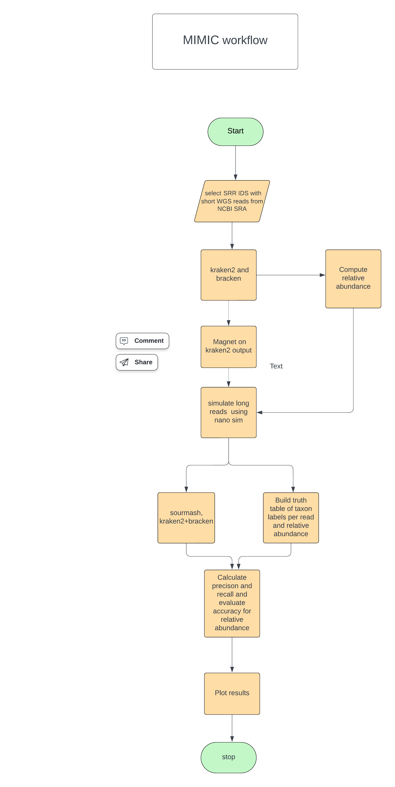

# MIMIC Metagenome Simulator

### MIMIC Workflow

# Introduction

Oxford Nanopore (ONT) sequencing is a key technology in metagenomic studies, offering long reads that are essential for resolving complex genomic structures among microbial communities. However, the platform comes with specific technical challenges, which necessitate the development of specialized bioinformatic algorithms. To accurately evaluate and benchmark these bioinformatics algorithms, MIMIC emerges as a valuable tool for simulating metagenomic long read (ONT) sequencing data and microbial communities. It provides simulated datasets that replicate the nuances of the sequencing platform being used, and allows researchers to generate realistic fastq files and abundance tables from metagenomes, facilitating the benchmarking and testing of bioinformatics tools in controlled conditions. These simulations provide a cost-effective means of testing in a controlled environment, ensuring that tools perform as expected before being applied to real-world data.

