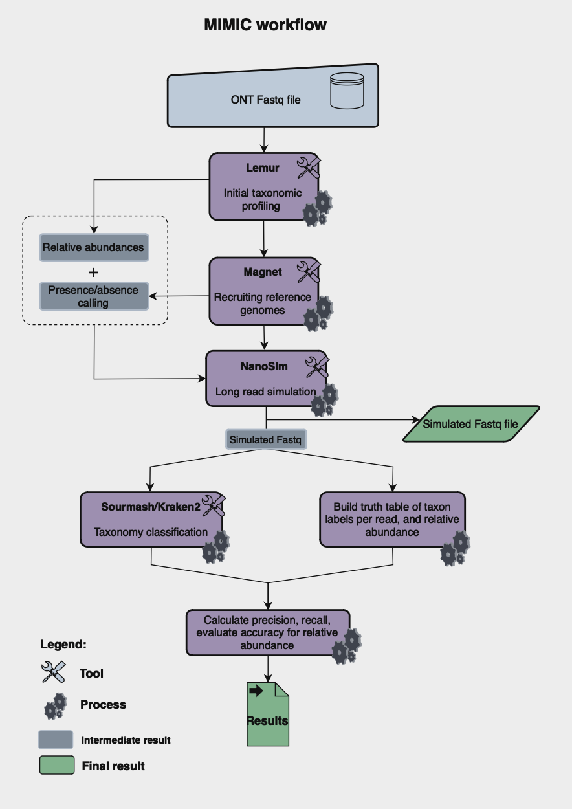

# Presentation

[Slides](https://docs.google.com/presentation/d/1B8EIzaHBaFGJ8tusNSZbC7iCNzR93OCdnW5cuvXCjAc/edit?usp=sharing)

# MIMIC Metagenome Simulator

The MIMIC Metagenome simulator creates simulated Oxford Nanopore (ONT) reads from any existing metagenomic community
by taking in a fastq file and analyzing the naturally occurring microbial abundances. 

This project was conceptualized and built during the
Baylor College of Medicine Human Genome Sequencing Center (HGSC) 2024 Hackathon. 


## Table of Contents 
1. [Introduction](#introduction)
2. [MIMIC workflow](#mimic-workflow) 
3. [Installation](#installation) 
4. [Usage](#usage)
5. [Outputs](#MIMIC-Simulator-Pipeline-Outputs)
6. [Truth Table](#Example-truth-table)
7. [Example](#Soil-example)
8. [Contributors](#contributors) 
9. [References](#references) 


## Introduction

Oxford Nanopore (ONT) sequencing is rapidly becoming a widely used sequencing technology in metagenomic studies due to its cost, long reads, and significantly improved error rate[^1]. We built The MIMIC Metagenome simulator to create a simple tool to facilitate the benchmarking and testing of metagenomic profiles and taxonomic classifiers on compositions that mimic real-world microbiome samples (sequenced with ONT reads). Specifically,  MIMIC will simulate Oxford Nanopore (ONT) reads from any existing metagenomic community by taking in an ONT FASTQ file and analyzing it with Lemur and Magnet[^2]. It will then simulate reads based on the Lemur and Magnet mimicked profile with Nanosim[^3]. Once the truth tables are generated for simulated data based on real microbiome samples, MIMIC offers a simple-to-use evaluation framework for comparing the results of existing methods to the known truth data simulated by Nanosim.

## To do list

- [x] Implement mimic.py script with basic functionality
- [x] Create workflow diagram depicting the main components of MIMIC
- [x] Generate simulated data for two ONT soil metagenome samples (SRR30413550, SRR29660113)
- [x] Run Kraken2+Bracken and Sourmash on the MIMIC output for an ONT soil metagenome sample
- [x] Add recall and precision metrics for the ONT soil metagenome simulated data
- [x] Add installation and usage details to readme
- [ ] Get MIMIC set up and running in DNAnexus environment
- [ ] Add gene gain/gene loss events into the reference genomes

### MIMIC Workflow


The MIMIC workflow takes in Oxford Nanopore metagenomic reads in fastq format, these reads are then processed by Lemur[^2], which performs an initial taxonomic profiling and generates an abundance table. The profile is then fed into Magnet [^2], which downloads all of the reference genomes and performs competitive read-alignment in order to determine final presence/absence calls. Abundances from Lemur are then mapped to the present genomes, which are inputted into Nanosim. Nanosim outputs a simulated file in fasta files, as well as the error profiles (if --perfect not used). A full description of the outputs is included below. 

The second aspect in the pipeline is to compare to existing tools. ADD INFO HERE


## Installation
Mimic can be installed using the following steps: 
`````
## Clone the git repository
git clone https://github.com/collaborativebioinformatics/Mimic.git

## cd into the repository
cd Mimic/

## Setup the conda environment
conda env create -f mimic_env.yml
conda activate mimic
`````

## Usage
The Mimic simulator can be run using the following command:
`````
python mimic.py -i [fastq] -o [output_loc] -r [num_reads] --db [lemur_db] -t [threads]

arguments:
  -h, --help            show help message and exit
  -i FASTQ, --fastq FASTQ
                        Path to first fastq file (required)
  -I FASTQ2, --fastq2 FASTQ2
                        Path to second fastq file for paired-end reads
  -o OUTPUT, --output OUTPUT
                        Path to the output directory (required)
  --db DB               Lemur database location (required)
  -t THREADS, --threads THREADS
                        Number of threads for multithreading (Default: 1)
  -r READS, --reads READS
                        Number of simulated reads to generate (Default: 100)
  --simulate-only
                        Only runs simulation (must have already run pipeline on sample once, will override existing simulated data)
  --perfect
                        Will generate perfect reads from the genomes, ignores nanosim profiles

`````

Some helpful things to keep in mind:
- Depending on the file size, the lemur/magnet/nanosim model generation steps are the slowest. Thus, once run on a sample, use the `--simulate-only` tag to generate new simulated data based off that profile


## MIMIC Simulator Pipeline Outputs
The following provides a brief description of important outputs from the Mimic simulator, assuming `-o output`

`output/lemur/relative_abundance.tsv` -- Initial taxonomic profiling file from Lemur. Column 1 is taxonomy ID, and 'F' column is the relative abundance   
`output/magnet/cluster_representative.tsv` -- Magnet details, including reference details as well as the presence/absence calls in the final column   
`output/magnet/reference_genomes/*` -- Location of downloaded reference genomes from Magnet, note that not all will be included in Nanosim simulation   
`output/nanosim/abundances.tsv` -- contains species and abundances inputted into nanosim, top row contains number of reads generated     
`output/nanosim/genome_list1.tsv` -- contains species and reference genome location, as well as input abundance    
`output/nanosim/genome_list2.tsv` -- same as above, without abundances   
`output/simulated_data/simulated.fasta` -- the simulated fasta files. See the nanosim documentation for description on the read headers  

## Example truth table
The truth table, based off of the abundances in `abundances.tsv`, is used for both input into nanosim as well as validating
`````
Size	100000
Paraburkholderia fungorum	0.97
Paraburkholderia phenazinium	2.9
Caballeronia udeis	2.42
Paraburkholderia sp. BCC1885	0.48
Mycobacterium cookii	8.77
Mycobacterium sp. 1245111.1	7.85
Candidatus Mycobacterium methanotrophicum	40.82
Trebonia kvetii	35.78
`````

## Soil Example
We ran the Mimic pipeline on the following SRA samples ([SRR29660113](https://trace.ncbi.nlm.nih.gov/Traces/?view=run_browser&acc=SRR29660113&display=metadata) and [SRR30413550](https://trace.ncbi.nlm.nih.gov/Traces/?view=run_browser&acc=SRR30413550&display=metadata)). Metagenomes were simulated at 1k, 50k, and 100k reads for both 'perfect' reads and default error-prone reads. 

For the 1k reads we can evaluate the accuracy of Kraken2's classification of each read at every taxonomic rank. For the 'perfect' reads, we get:

```
rank    FN      TP      FP      TN      Prec    Rec
species 104     511     385     0       0.570   0.511
genus   47      799     154     0       0.838   0.799
family  41      862     97      0       0.899   0.862
order   39      868     93      0       0.903   0.868
class   33      955     12      0       0.988   0.955
phylum  29      965     6       0       0.994   0.965
```

While for the error-prone reads, we get:
```
rank    FN      TP      FP      TN      Prec    Rec
species 930     22      48      0       0.314   0.022
genus   923     24      53      0       0.312   0.024
family  924     28      48      0       0.368   0.028
order   921     32      47      0       0.405   0.032
class   920     37      43      0       0.463   0.037
phylum  915     49      36      0       0.576   0.049
```

This illustrates the heavy impact that sequencing error can have on the accuracy of Kraken2 taxonomic classifications. For reads without error, Kraken's only shortcoming is that at very low taxonomic ranks it fails to classify in roughly half of the cases, but does quite well at genus and above. With error, it fails to classify over 90% of the reads at every rank and incorrectly classifies more than half of the rest!

## Contributors

Hackathon team: Todd Treangen, Shwetha Kumar, Ryan Doughty, Sumaiya	Khan, Iva	Kotásková, Arthur	Shem Kasambula, Mike Nute

## References 

[^1]: Agustinho, Daniel P., Yilei Fu, Vipin K. Menon, Ginger A. Metcalf, Todd J. Treangen, and Fritz J. Sedlazeck. "Unveiling microbial diversity: harnessing long-read sequencing technology." Nature Methods (2024): 1-13.

[^2]: Sapoval, Nicolae, Yunxi Liu, Kristen Curry, Bryce Kille, Wenyu Huang, Natalie Kokroko, Michael G. Nute et al. "Lightweight taxonomic profiling of long-read sequenced metagenomes with Lemur and Magnet." bioRxiv (2024): 2024-06.

[^3]: Yang, Chen, Justin Chu, René L. Warren, and Inanç Birol. "NanoSim: nanopore sequence read simulator based on statistical characterization." GigaScience 6, no. 4 (2017): gix010.
