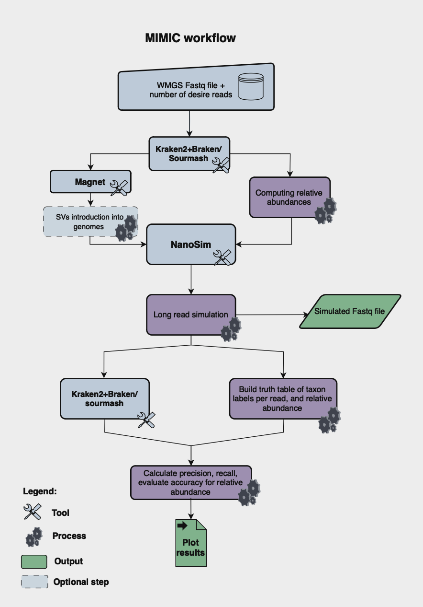

# MIMIC Metagenome Simulator

Hello to everybody. Here you find information to the MIMIC pipeline, which has been developed 
during the 2024 Hackathon at HGSC-BCM by the Metagenomics team. 
Our pipeline simulates results of the long read sequencing, and prvoides artifical metagenomes. 
As a results, the abundance table and fastq file are avaliable.  

## Table of Contents 
1. [Introduction](#introduction) 
2. [Installation](#installation) 
3. [Dependencies](#dependencies)
4. [How to use It](#how-to-use-it) 
6. [MIMIC workflow](#mimic-workflow) 
7. [Contributors](#contributors) 
8. [References](#references) 

## Introduction

Oxford Nanopore (ONT) sequencing is a key technology in metagenomic studies, offering long reads that are 
essential for resolving complex genomic structures among microbial communities. 
However, the platform comes with specific technical challenges, which necessitate the development of 
specialized bioinformatic algorithms. To accurately evaluate and benchmark these bioinformatics algorithms,
MIMIC emerges as a valuable tool for simulating metagenomic long read (ONT) sequencing data and microbial 
communities. It provides simulated datasets that replicate the nuances of the sequencing platform being used,
and allows researchers to generate realistic fastq files and abundance tables from metagenomes, facilitating 
the benchmarking and testing of bioinformatics tools in controlled conditions. These simulations provide a 
cost-effective means of testing in a controlled environment, ensuring that tools perform as expected before 
being applied to real-world data.

## Installation

## Dependencies

### To generate simulated reads

- Python 3.9
- NCBI Datasets v15.27.1
- Minimap2 v2.24-r1122
- Samtools v1.15.1
- Biopython
- Pandas
- Ete3 v3.1.2
- BWA v0.7.17
- FastANI
- Kraken2
- Bracken
- Nanosim

### To generate truth table

### Other 

## How to use It

### MIMIC Workflow

## Contributors

Hackathon team: Todd	Treangen, Shwetha	Kumar, Ryan	Doughty, Sumaiya	Khan, Iva	Kotásková, Arthur	Shem Kasambula, Mike	Nute

## References 

